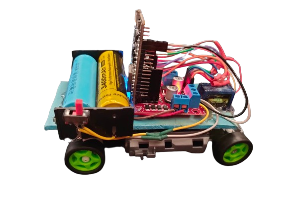

# 🕯️What is wifi remote control car ?
- General controlled cars are controlled via radio signals, but This remote control car can be controlled via WIFI. With the Blynk mobile application, we can control it from anywhere as long as we have an internet connection.
 

  

# ✨ Blynk

  

